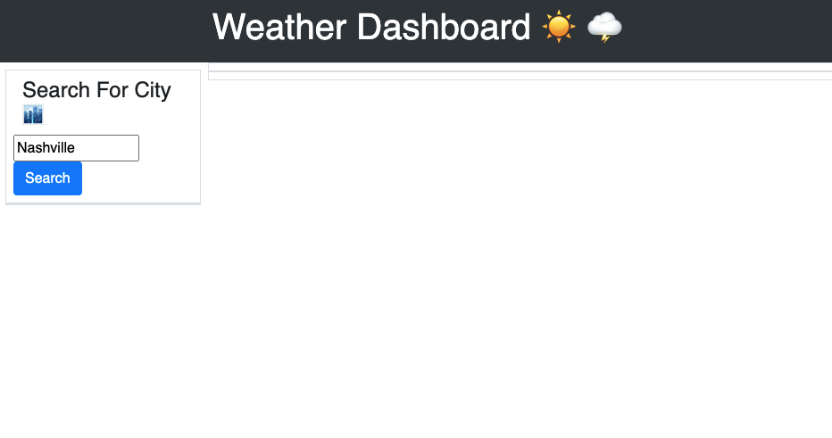
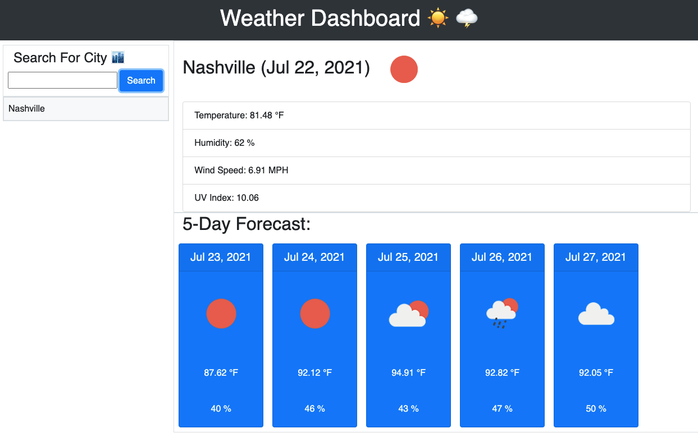

# Weather-Dashboard
### Description
Weather-Dashboard is an application to find the current weather condition of a selected city both the current and 5-Days forecast at the same time.
A server-side API was used to pull data objects for components.

- City
- Date
- Temperature
- Humidity
- Wind Speed
- UV index

The local storage is used here to store the previous search city and display them to the user in the left side of the page under the list group. The user can also clear the search history by clicking the clear history button.
If the user wants to see the past search city weather condition again, just click the list group item cities under the clear history button.

### Screenshots:
1. Run file index.html

2. Enter any city

Created with :heart: by: **Zach Puckett**
